# Robot Data Acquisition Operation Instructions

This document details the complete workflow for robotic offline data acquisition and transmission based on the RobotEra XOS system, in conjunction with Meta Quest devices equipped with the RobotEra Teleoperation App.
## 1. Robot XOS System Launches Data Acquisition App
1. Enter the main interface of the robot XOS system, and find the **Application Management** entry in the system function module. 
1. Find and launch **xbot_data_capture_app (Data Acquisition Application)** in the application list, and enter the main page of Data Acquisition operations.
1. The main interface of the application supports auxiliary functions such as application installation, log management, CPU frequency viewing, robot joint monitoring, data export, system upgrade, etc., which can be used as needed. 
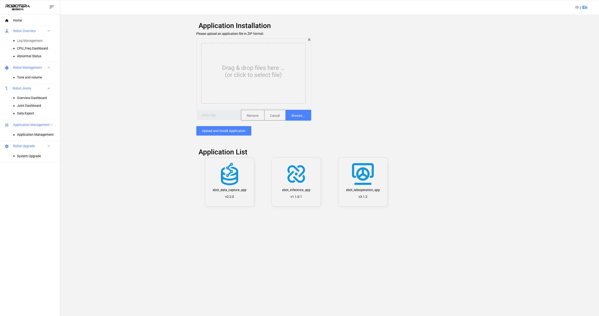

## 2. Select Offline Data Acquisition Mode
1. After the Data Acquisition App is launched, select **Offline Acquisition** option on the main interface (it supports both offline and online acquisition modes, and this process uses offline acquisition). 
1. Confirm that the authorization file has been uploaded (the interface shows "Authorization file has been uploaded", and you can re-upload it as needed), then enter the **Offline Data Acquisition Task List** page.
1. The Task List displays all historical acquisition tasks, including core information such as task name, data acquisition frame rate, video acquisition frame rate, task description, acquisition progress, creation time, etc., and supports task filtering and paginated viewing. 
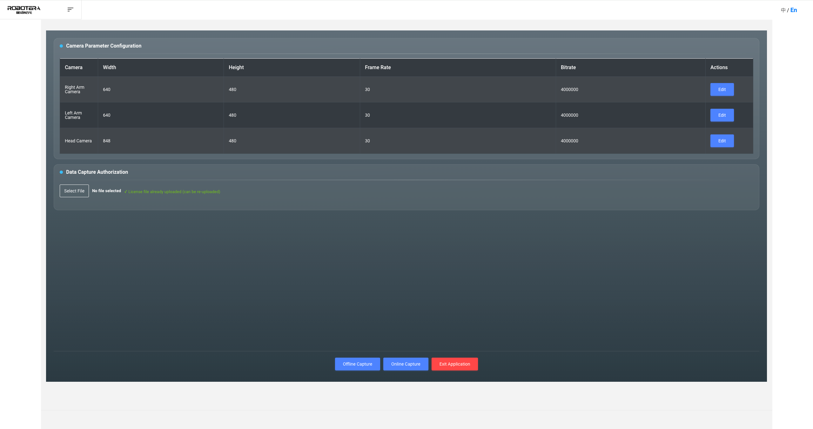

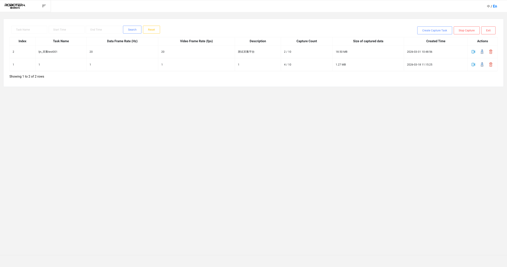

## 3. Create an Offline Data Acquisition Task
1. On the Offline Data Acquisition Task List page, click the **Create Data Acquisition Task** button, and the task configuration form will pop up.
1. Fill in the required parameters as requested:
  - **Task Name**: Customize the name of this data acquisition task for easy identification and management.
  - **Acquisition Quantity**: Set the total number of acquisition samples to be completed this time. 
  - **Data Acquisition Frame Rate**: Sets the data acquisition frequency of the robot body, with a value range of **1 to 500 Hz**.
  - **Video Acquisition Frame Rate**: Sets the frame rate for video frame acquisition, with a value range of **1 to 60 fps**.
  - **Task Description**: Supplement information such as acquisition purpose, test scenario, and precautions, with a character limit of **within 500 characters**. 
1. After confirming that the parameters are correct, click **Save** to complete task creation; if you need to abandon, click **Cancel** to return to the task list. 
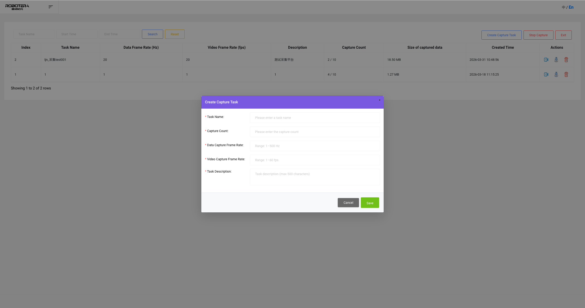

## 4. Enter the Data Acquisition Task Details Page
1. In the offline data acquisition task list, find the target task that has been created. 
1. Click the **Start Data Acquisition** button corresponding to the task to enter the **XOS Data Acquisition Details Page** of this task, and wait for the VR teleoperation device to connect and execute the data acquisition action.
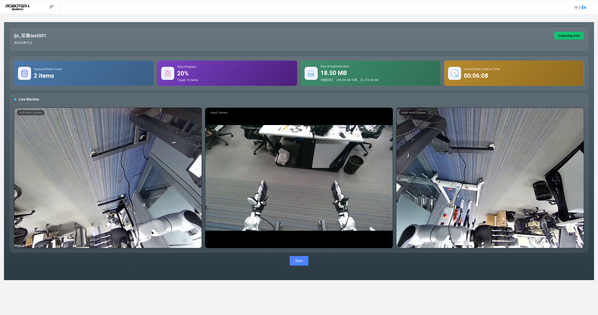

##### 
## 5. Perform offline data acquisition via Meta Quest VR devices
### Download  "RobotEra Teleoperation " App from the App Store
Search for 「RobotEra Teleoperation」 in the Meta Quest App Store, click on the app to enter the details page, click 「Download」, and after the download is complete, you can launch and use it.
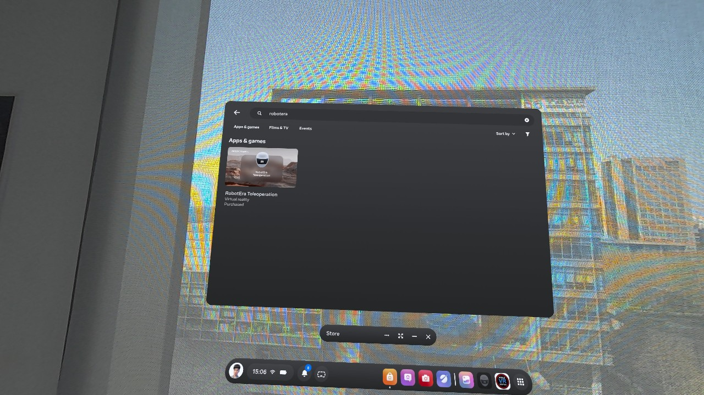

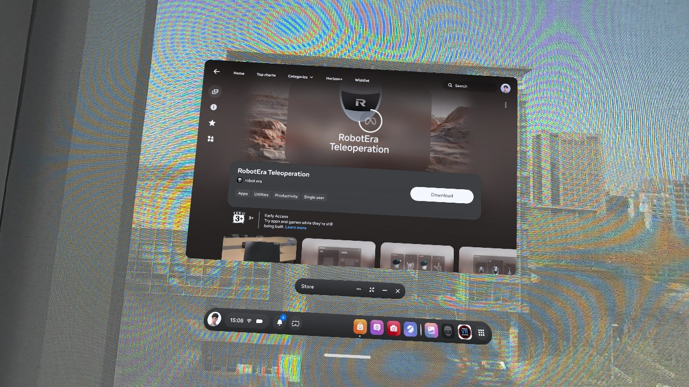

### (1) Connect to the robot network
1. Turn on the Meta Quest VR device and enter the device **System Settings** interface.
1. Select Network Connection Method:
  - **Wired Connection**: Using a dedicated data cable, directly physically connect the Meta Quest to the robot body, which is stable and reliable.
  - **WiFi Connection**: Find the robot's dedicated hotspot in the WiFi list, enter the correct password, and complete network pairing.
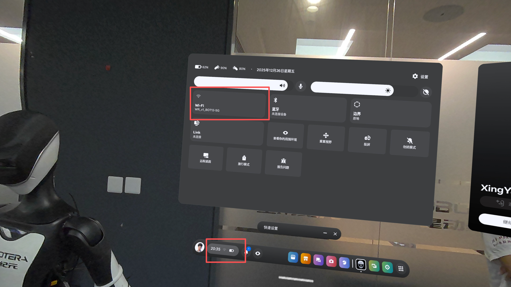

### (2) Launch the  "RobotEra Teleoperation "   App
1. In the **App List / Library** of the Meta Quest device, find the **"RobotEra Teleoperation"** icon. 
1. Click the icon to start the application and enter the main interface of remote operation. 
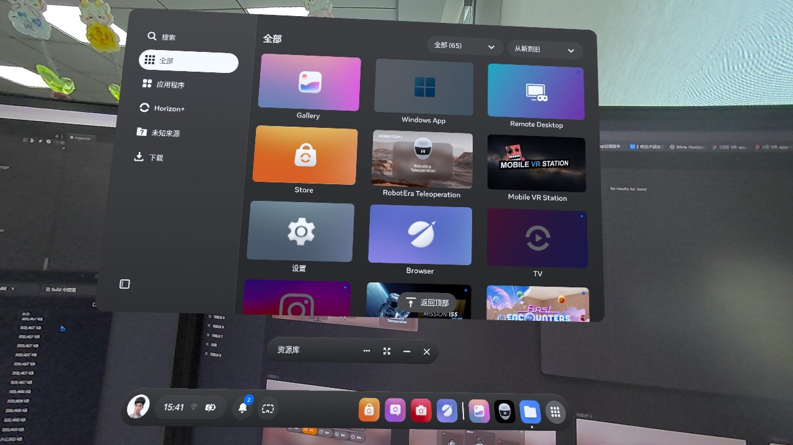

### (3) Configure Robot Connection
1. In the **Robot List** module of the **"RobotEra Teleoperation"** App, click the **plus sign (+)** to add a device. 
1. Select Connection Method **Intranet Connection**, Enter Robot **IP Address** and **Port Number**.
1. Click the **Connect** button and wait for the system to pair; after successful connection, the interface will prompt **Robot Connected**.

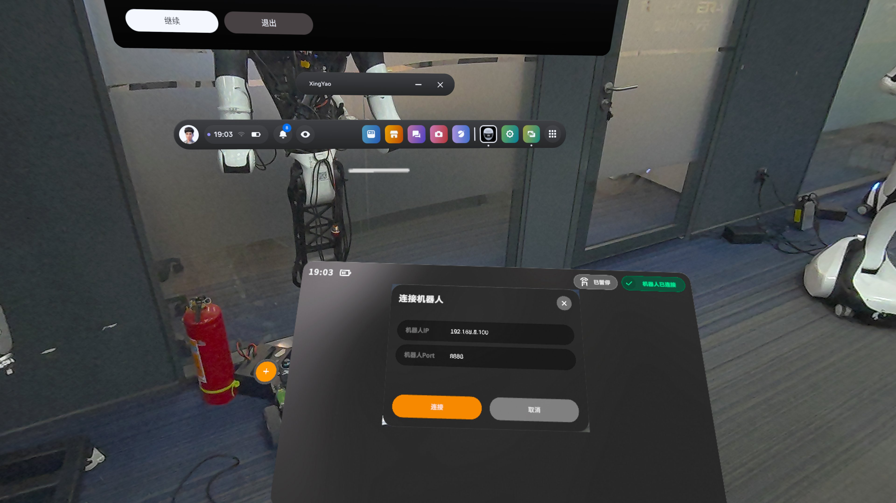

### (4) Remote Operation Parameter Configuration
After successful connection, parameters can be customized according to acquisition requirements: 
1. **Operation Mode**: Supports **Controller Mode**, **Gesture Tracking Mode** Switching, Adapting to Different Acquisition Actions.
1. **Video Clarity**: Offers **three levels of Standard Definition, High Definition, and Ultra High Definition** for selection, balancing image quality and transmission smoothness.
1. **Name Remarks**: Customize the robot's remark name to facilitate quick differentiation and management in multi-device and multi-robot scenarios.
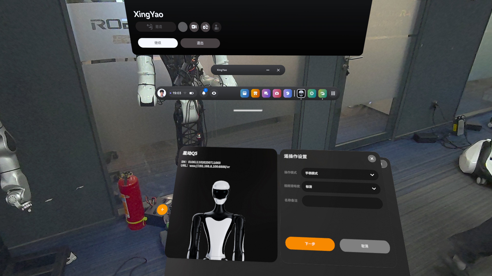

### (4) Remote Operation Button Instructions

<table>
  <thead>
    <tr>
      <th colspan="3" style="text-align:center">MetaQuest Joystick Button Operation Instructions</th>
    </tr>
    <tr>
      <th></th>
      <th>Button Function</th>
      <th>Button Mode</th>
    </tr>
  </thead>
  <tbody>
    <tr>
      <td rowspan="6" style="text-align:center">Move</td>
      <td>Forward</td>
      <td>Push the left joystick forward</td>
    </tr>
    <tr>
      <td>Back</td>
      <td>Left Joystick Backward</td>
    </tr>
    <tr>
      <td>Turn Left</td>
      <td>Right Joystick Left</td>
    </tr>
    <tr>
      <td>Turn Right</td>
      <td>Right Stick Right</td>
    </tr>
    <tr>
      <td>Left Translation</td>
      <td>RG + Right Joystick Left</td>
    </tr>
    <tr>
      <td>Right Translation</td>
      <td>RG + Right Stick Right</td>
    </tr>
    <tr>
      <td rowspan="3" style="text-align:center">Gesture</td>
      <td>Gesture Switching</td>
      <td>LG + Left Joystick to switch left and right (switch both hands simultaneously)</td>
    </tr>
    <tr>
      <td>Left Hand Grasping</td>
      <td>Left Joystick Trigger Button</td>
    </tr>
    <tr>
      <td>Right Hand Grasping</td>
      <td>Right Joystick Trigger Button</td>
    </tr>
    <tr>
      <td rowspan="7" style="text-align:center">Teleoperation Application</td>
      <td>Start/Pause Teleoperation</td>
      <td>LG+RG+A</td>
    </tr>
    <tr>
      <td>Confirm Reset Position</td>
      <td>A</td>
    </tr>
    <tr>
      <td>Start/End Call</td>
      <td>B</td>
    </tr>
    <tr>
      <td>Start Data Acquisition</td>
      <td>X</td>
    </tr>
    <tr>
      <td>End Data Acquisition</td>
      <td>Y</td>
    </tr>
    <tr>
      <td>Hide/Show Video Window</td>
      <td>LG+RG+Y</td>
    </tr>
    <tr>
      <td>Robot pose reset</td>
      <td>LG+RG+X</td>
    </tr>
    <tr>
      <td style="text-align:center">MetaQuest</td>
      <td>Reset Origin</td>
      <td>Long press the Meta key</td>
    </tr>
  </tbody>
</table>

## 6. Robot XOS Data Acquisition App Downloads Data Locally
1. After the data acquisition task is completed, return to the **Offline Data Acquisition Task List** of the Robot XOS Data Acquisition App. 
1. Locate the target acquisition task, click the **Download** button on the right side of the task, and the system will automatically package and generate a data file in ZIP format. 
1. Wait for the download to complete. The data file will be saved to local storage and can be used for subsequent upload, backup, and analysis.
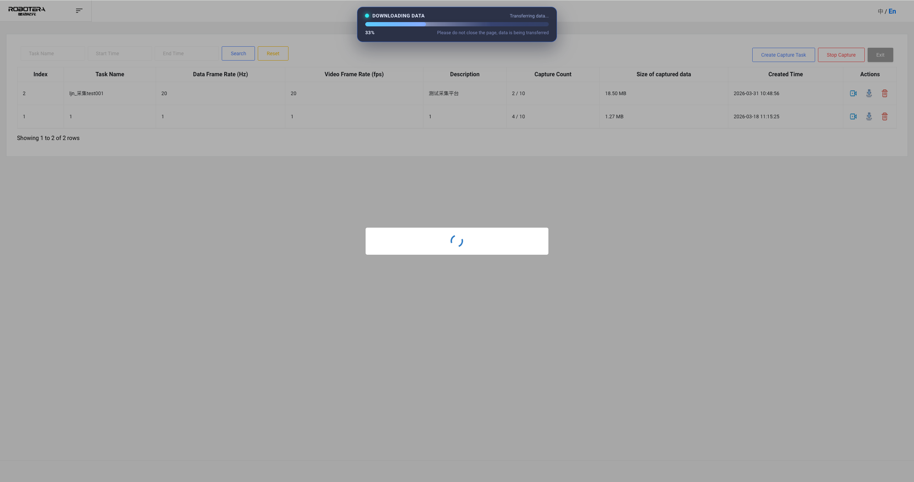

