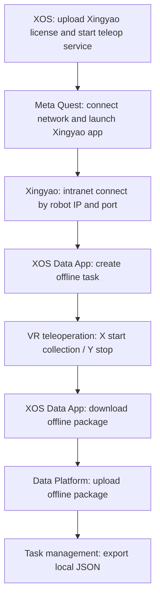

# Robotera Data Collection Operation Manual (English)

## 1. Purpose

This manual defines how to run Robotera data collection with focus on offline collection, local download, and local export.

## 2. M7 Collection Baseline

- Robot model: M7
- ROS2 distro: Humble
- ROS domain: `211`
- Recommended RMW: `rmw_cyclonedds_cpp`
- Fixed robot address: `192.168.8.100` (manual marks this as restricted)
- Developer container: `ssh developer@192.168.8.100 -p 2222`

## 3. Preconditions

1. Robot hardware is powered on and passed self-check.
2. Emergency-stop remote is prepared and operators know A/D behavior.
3. Teleoperation link is healthy (wired or onboard Wi-Fi).
4. Storage capacity is sufficient.
5. Camera, joint state, and end-effector streams are available.

Reference figures:

## 4. Xingyao App + Meta Quest Setup (Required)

### 4.1 Prepare teleoperation service in XOS

1. Open `http://192.168.8.100:1888` and locate Teleoperation App in XOS.
2. Upload encrypted license file and wait for validation success.
3. Start XOS teleoperation app and confirm service ready.

### 4.2 Connect Meta Quest and launch Xingyao app

1. Connect Meta Quest to robot network (wired or Wi-Fi).
2. Launch Xingyao app on Meta Quest.
3. Select intranet connection and configure robot IP/port.
4. Choose control mode (joystick mode or hand-tracking mode).

### 4.3 Collection-related key controls (joystick mode)

- Start/Pause teleoperation: `LG + RG + A`
- Start data collection: `X`
- Stop data collection: `Y`
- Reset origin (coordinate recalibration): `long press Meta key`

## 5. Offline Collection in XOS Data App

1. Start data collection App on robot XOS.
2. Select offline collection mode.
3. Create offline task (task name and target count).
4. Execute collection with Xingyao App + Meta Quest teleoperation.
5. Download offline package to local.

## 6. Upload Offline Package and Export to Local

### 6.1 Upload offline package to platform

1. Open task detail page in data collection platform.
2. Click upload offline package.
3. Select local package and upload.
4. Confirm platform shows collected data count.

### 6.2 Export collected data to local JSON

Project admin can export completed collection tasks from task management page. Platform generates JSON and browser downloads it to local.

## 7. Offline Collection Flow (Mermaid)

## 8. Sensor/Topic Recommendations (Collection Side)

At minimum, align and preserve timestamps for these depth-camera related topics:

- `/camera/camera/color/image_raw`
- `/camera/camera/depth/image_rect_raw`
- `/camera/camera/depth/camera_info`
- `/camera/camera/extrinsics/depth_to_color`
- `/tf_static`

Reference figure:

## 9. Export Requirements

- Must follow `../interfaces/dataset_schema.md`.
- Every episode must include complete metadata and timestamps.
- If interruptions happen, annotate anomaly tags in `metadata.json`.

## 10. Common Issues

- Recording interruption: check Xingyao connection, network stability, and control service health.
- Timestamp misalignment: check clock sync and recording lifecycle.
- Image/state desync: check topic frequency and system load.
- Control drift: use long-press Meta key to reset origin.
