# Robotera 数据采集操作手册（中文）

## 1. 文档目的

本手册用于说明如何使用 Robotera 现有采集软件完成 VLA 训练数据的采集、离线下载与本地导出。

## 2. M7 采集基础信息

- 机器人型号：M7
- ROS2 版本：Humble
- ROS Domain：`211`
- 推荐 RMW：`rmw_cyclonedds_cpp`
- 固定地址：`192.168.8.100`（文档明确限制改动）
- 开发者容器：`ssh developer@192.168.8.100 -p 2222`

## 3. 前置检查

1. 机器人硬件上电并通过自检。
2. 急停遥控器在手边，调试人员明确 A/D 键作用。
3. 遥操作链路连接正常（有线或连接机身 Wi-Fi）。
4. 采集存储空间满足任务要求。
5. 相机、关节状态、末端状态数据可见。

参考图：

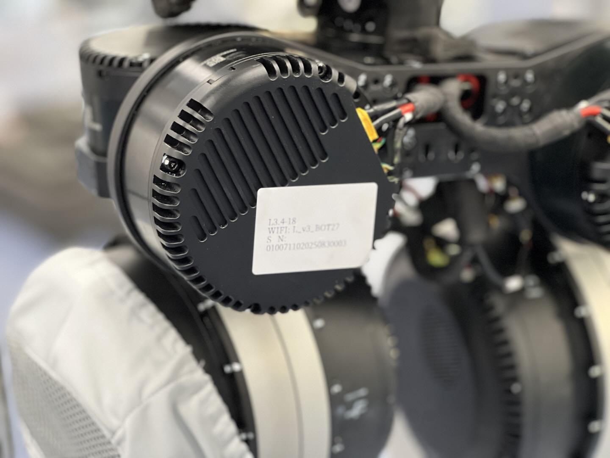

## 4. 星遥 App + Meta Quest 准备（采集必备）

### 4.1 在 XOS 端准备遥操作服务

1. 打开 `http://192.168.8.100:1888`，进入 XOS 应用管理，找到「遥操作 App」。
2. 上传最新授权文件并等待校验成功。
3. 启动 XOS 端遥操作 App，确认服务启动完成。

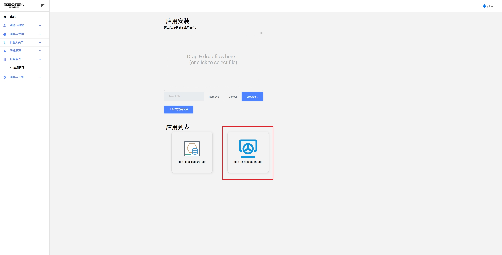
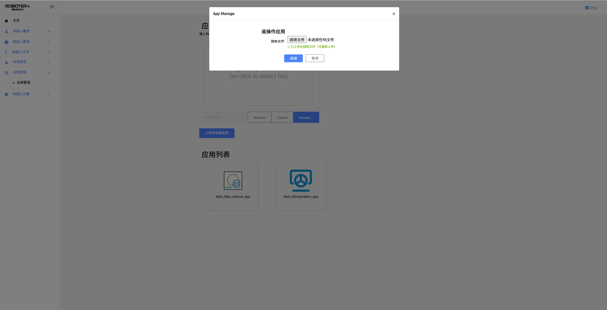
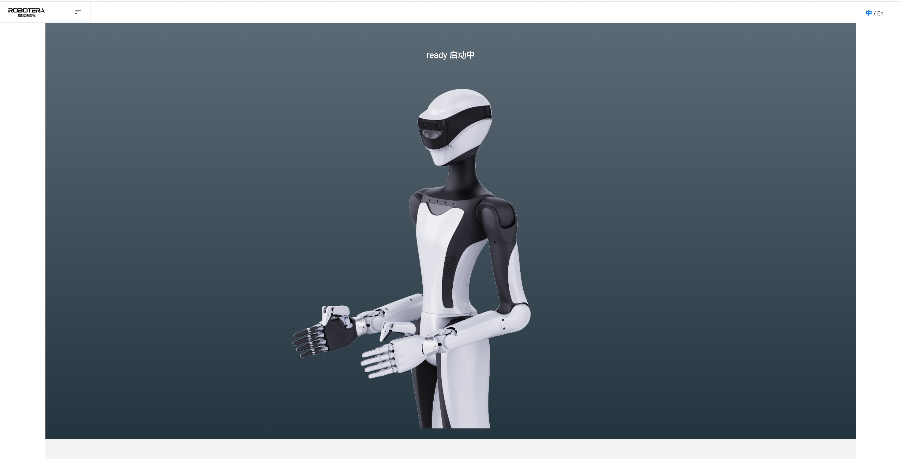
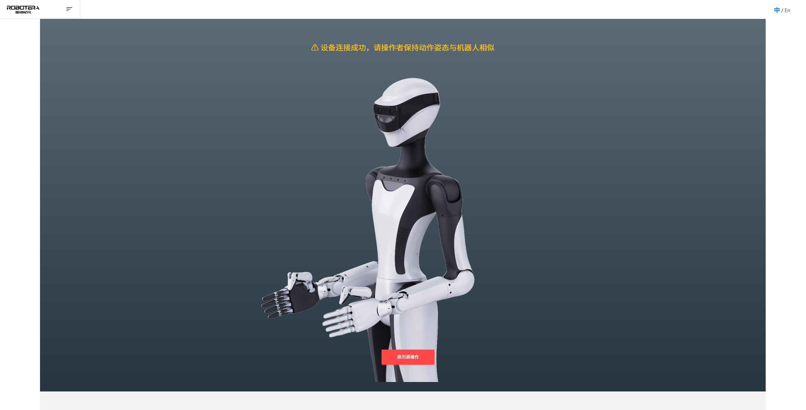

### 4.2 连接 Meta Quest 与启动星遥 App

1. Meta Quest 连接机器人网络（有线或 Wi-Fi）。
2. 在 Quest 应用列表启动「星遥 App」。
3. 在星遥 App 中选择「内网连接」，输入机器人 IP 和端口后连接。
4. 连接后选择操作模式（手柄模式或手势追踪模式）。

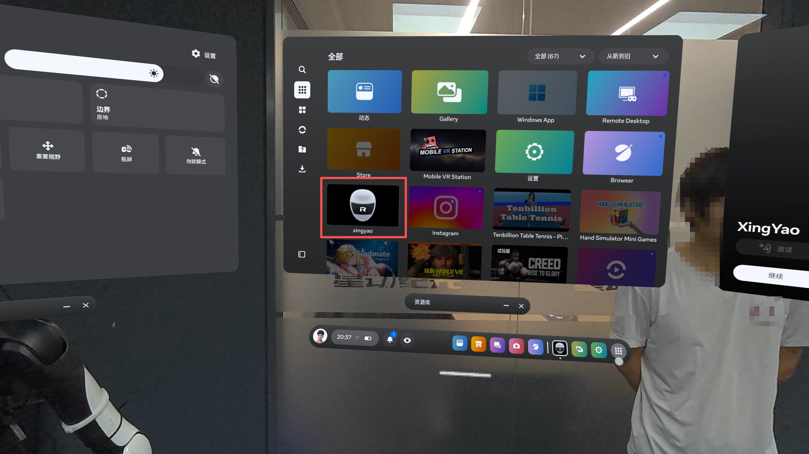
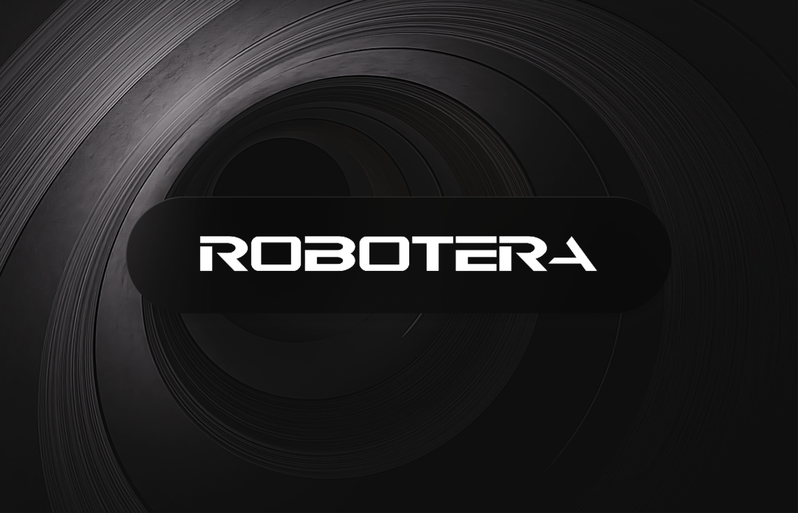

### 4.3 采集相关关键按键（手柄模式）

- 开始/暂停遥操作：`LG + RG + A`
- 开始数据采集：`X`
- 结束数据采集：`Y`
- 重置原点（坐标系校准）：`长按 Meta 键`

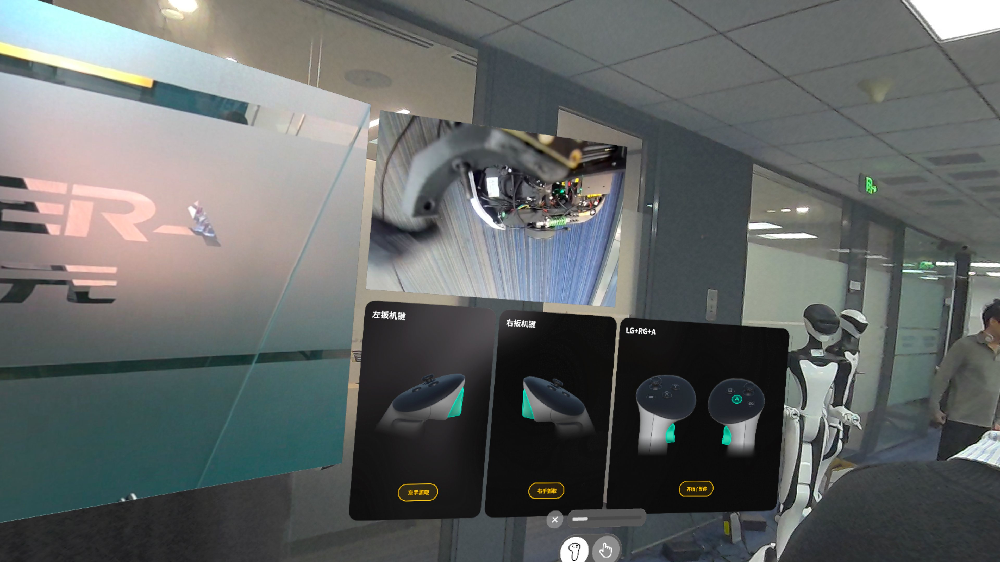

## 5. 离线数据采集（XOS 数据采集 App）

### 5.1 启动采集 App

在机器人 XOS 中启动数据采集 App。

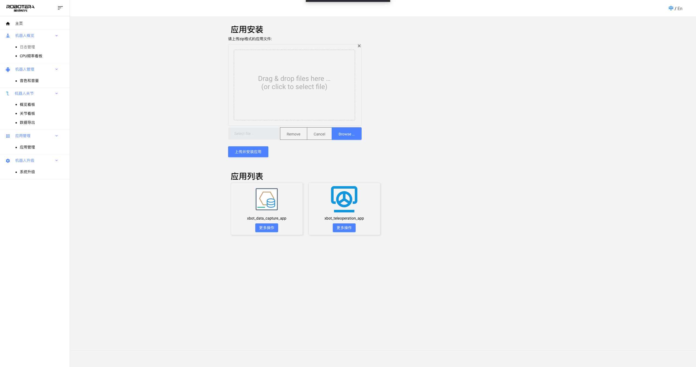

### 5.2 进入离线采集模式

在 App 选择采集模式，进入“离线采集”。

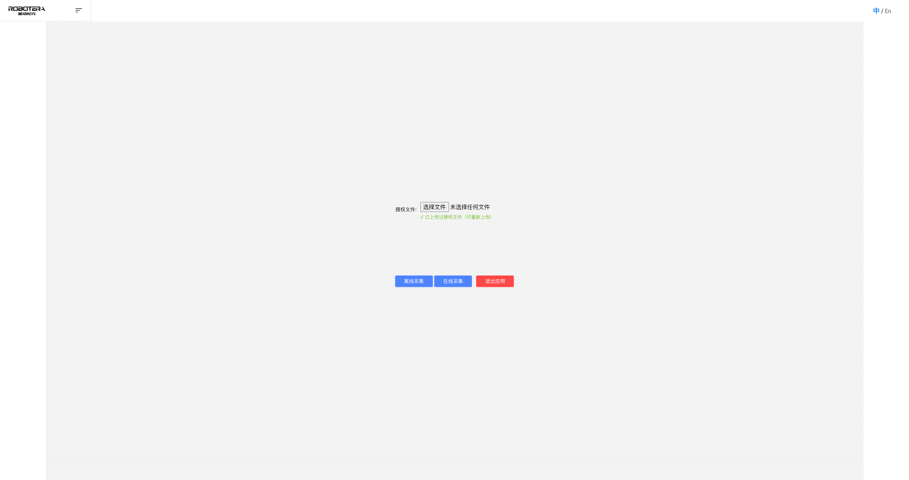
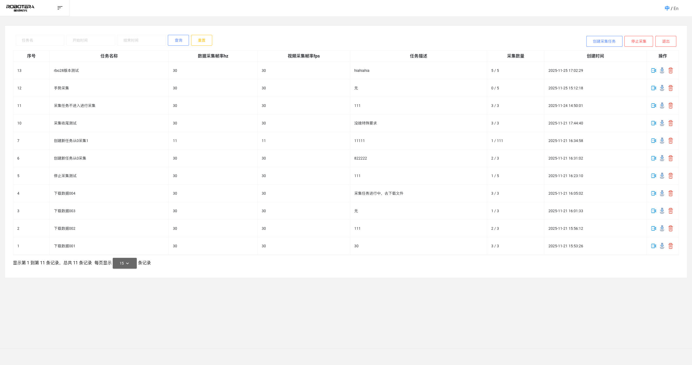

### 5.3 创建离线任务

点击“创建离线采集任务”，设置任务名称、采集数量等参数。

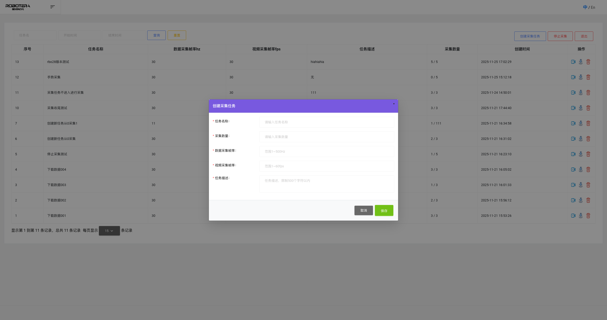

### 5.4 执行离线采集

通过星遥 App + Meta Quest 遥操作执行采集，数据先暂存于本地。

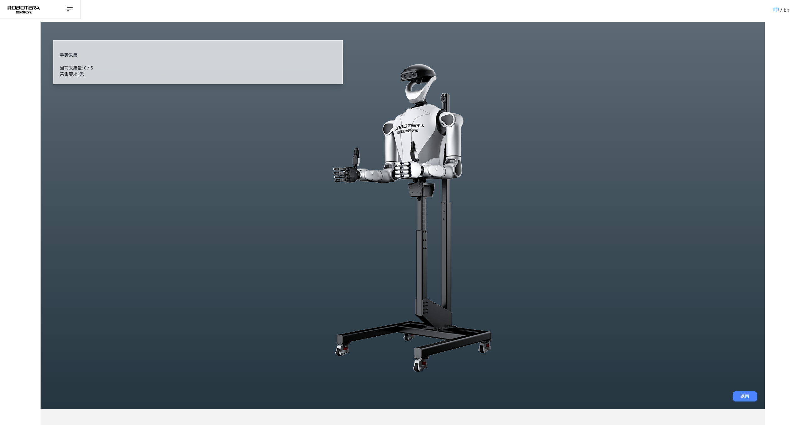

### 5.5 下载离线数据到本地

在 XOS 数据采集 App 中找到目标离线任务并执行“下载数据到本地”。

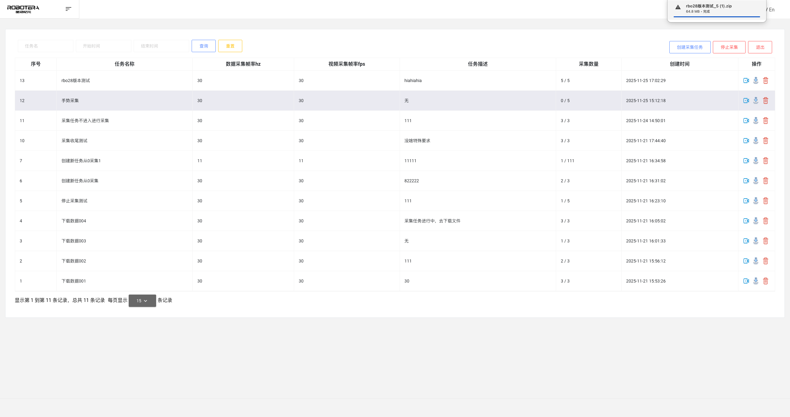

## 6. 上传离线数据包与本地导出

### 6.1 上传离线数据包到平台

在星动数据管理平台执行：

1. 在采集平台任务详情页点击“上传离线数据包”。
2. 选择本地数据文件开始上传。
3. 上传成功后平台显示已采集数据。

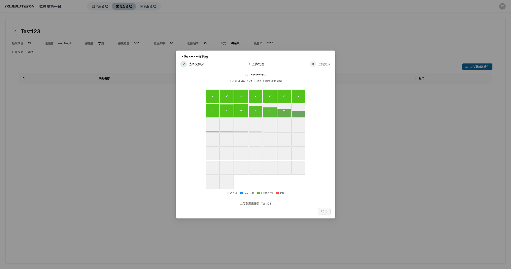

### 6.2 从平台导出采集数据到本地

项目管理员可在任务管理页选择已上传完成的任务，点击导出。系统生成 `json` 文件并自动下载到本地。

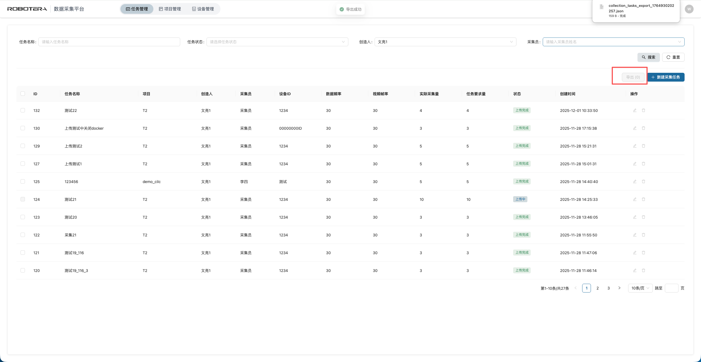

## 7. 离线采集与导出流程图（Mermaid）

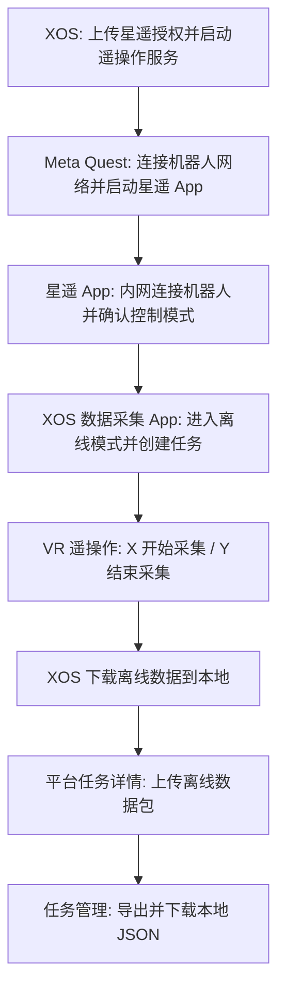

## 8. 传感器与主题建议（采集侧）

建议至少纳入以下深度相机相关主题的记录与时间对齐信息：

- `/camera/camera/color/image_raw`
- `/camera/camera/depth/image_rect_raw`
- `/camera/camera/depth/camera_info`
- `/camera/camera/extrinsics/depth_to_color`
- `/tf_static`

示例图：

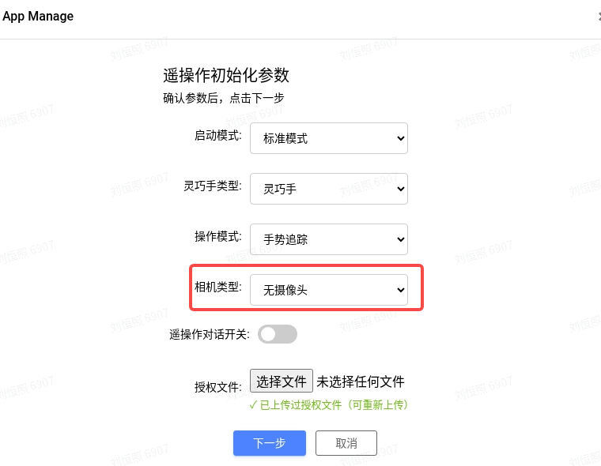

## 9. 导出要求

- 必须符合 `../interfaces/dataset_schema.md`。
- 每个 episode 要有完整元数据与时间戳。
- 若采集过程出现中断，须在 `metadata.json` 的 `anomaly_tags` 标注。

## 10. 常见问题

- 录制中断：检查星遥连接状态、网络稳定性与控制服务状态。
- 时间戳错位：优先检查时钟同步和录制流程。
- 图像与状态不同步：检查 topic 采样频率和系统负载。
- 控制漂移：按文档执行“长按 Meta 键”重置原点。
