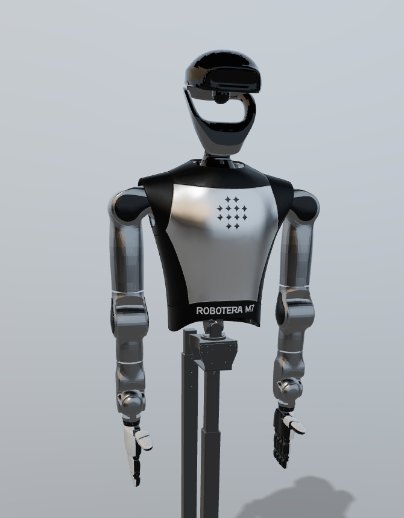
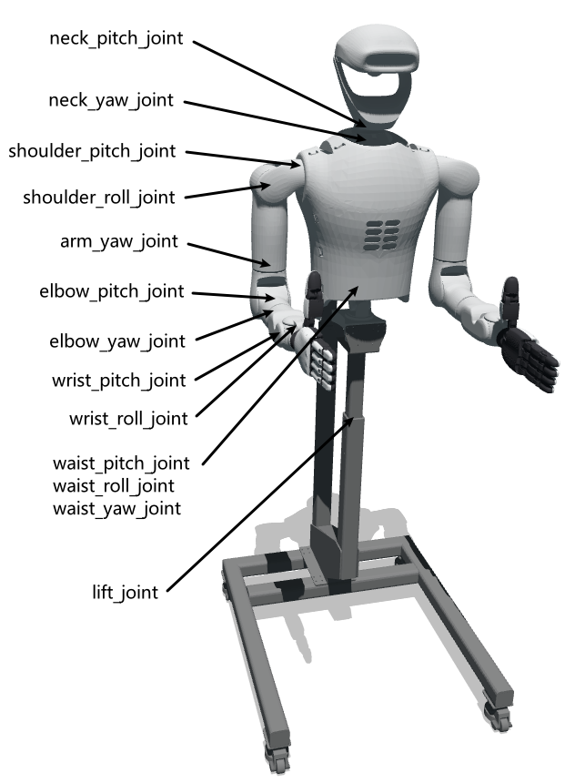
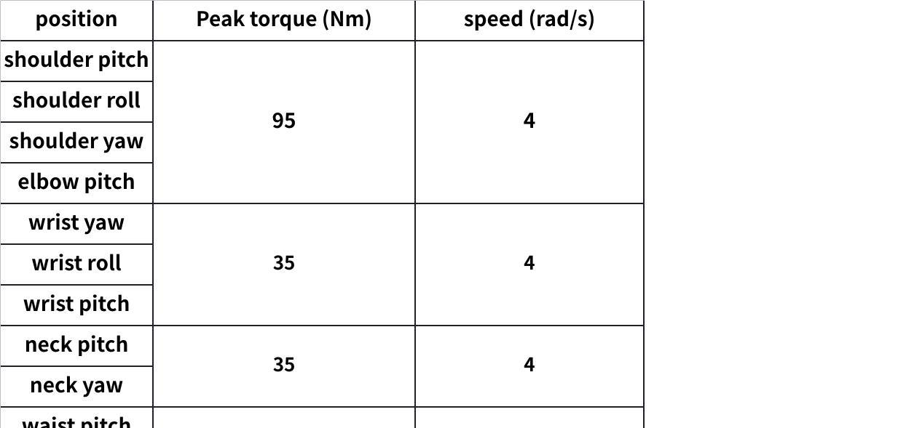

# Hardware and Software Requirements

## 0. Source Note

This baseline is extracted from `M7产品使用手册_V2.0.docx`.
For reproducibility, key manual figures are stored under `docs/assets/m7_manual/`.

## 1. M7 Robot Baseline (Project-Relevant)

### 1.1 Mechanical and Power

| Item | Value |
|---|---|
| Robot model | M7 |
| Base size | 650 x 675 mm |
| Height | 1585-1810 mm (adjustable) |
| Arm length | 717 mm x 2 |
| Single-arm payload | 10 kg |
| DOF | 43 (arms 7x2, waist 3, neck 2, dexterous hands 12x2) |
| Total weight | about 70 kg |
| End-effector speed | 3 m/s |
| End-effector precision | 0.02 mm |
| Battery | 57.6 V, 15 Ah, 864 Wh |

### 1.2 Compute and Perception

| Item | Value |
|---|---|
| Compute capability | 80 TOPS (x86) + 275 TOPS (Orin AGX) |
| Sensors (manual baseline) | depth camera, voice module |
| Communication interfaces | Ethernet, USB 4.0, Wi-Fi 6 |

### 1.3 Onboard Compute Detail

| Unit | Key spec |
|---|---|
| AMD Ryzen AI 9 HX 370 | CPU 12-core, RAM 32 GB, SSD 1 TB |
| Jetson Orin AGX 64 GB (optional) | 275 TOPS, 2048-core Ampere GPU, 12-core Arm CPU |

### 1.4 Key Manual Figures

- Robot overview

- Joint and motor section (including peak torque/speed chart)

- Onboard compute connection

## 2. Inference PC Requirements

### 2.1 Hardware

- CPU: 8+ cores recommended
- RAM: 32 GB+ recommended
- GPU: NVIDIA GPU with sufficient VRAM for selected checkpoint
- Storage: NVMe SSD with 200 GB+ free space
- Network: stable 1 Gbps LAN recommended

### 2.2 Software

- Ubuntu 22.04
- Python 3.10+
- ROS2 Humble
- Cyclone DDS runtime for M7 profile

## 3. M7 Connectivity and Runtime Baseline

- M7 ROS2 domain: `211`
- Recommended RMW: `rmw_cyclonedds_cpp`
- Robot fixed address (manual warning): `192.168.8.100` (do not modify robot-side fixed segment)
- Developer container SSH: `ssh developer@192.168.8.100 -p 2222`

## 4. Training Server (Placeholder Stage)

### 4.1 Hardware

- Multi-GPU machine recommended for pi0.5 fine-tuning
- Storage sized by dataset volume and checkpoint retention policy

### 4.2 Software

- Ubuntu 22.04
- Python 3.10+
- CUDA toolchain matching training framework

## 5. Safety and Maintenance Constraints

- Emergency-stop remote must be prepared during debugging.
- Battery maintenance constraints from manual should be treated as hard operational guidance.
- If robot and inference PC are on different subnets, DDS route/bridge validation is mandatory.
- NTP/PTP time synchronization is strongly recommended for observation/action timestamp alignment.
